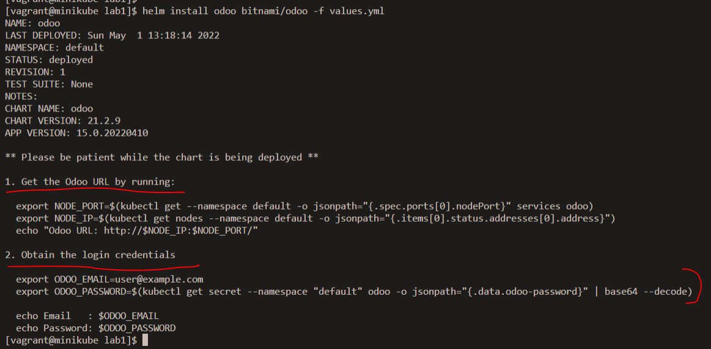

# Déploiement de odoo dans K8S
## 1 - Installez helm 3 sur votre cluster
Vous avez le nécessaire dans la documentation [ici](https://helm.sh/docs/intro/install)

##### Installer helm
Dans notre cas, nous allons juste taper les  commandes suivantes :
```
[vagrant@minikube ~]$ curl https://raw.githubusercontent.com/helm/helm/main/scripts/get-helm-3 | bash
```        

##### Vérifier l'installation
```
[vagrant@minikube ~]$ helm version
```
##### Checker les charts présents
```        
[vagrant@minikube ~]$ helm ls
```
## 2 - Utilisez le chart helm de l’application odoo pour le deployer

Dans un premier temps, nous allons créer un répertoire de travail qui contiendra nos sources, ensuite on va rajouter le chart odoo dans helm
```        
[vagrant@minikube ~]$ mkdir -p ~vagrant/lab1 
[vagrant@minikube ~]$ cd ~vagrant/lab1
[vagrant@minikube lab1]$ helm repo add bitnami https://charts.bitnami.com/bitnami
[vagrant@minikube lab1]$ helm ls
[vagrant@minikube lab1]$ helm repo update
[vagrant@minikube lab1]$ helm search repo odoo
[vagrant@minikube lab1]$ vi values.yaml
[vagrant@minikube lab1]$ helm install odoo bitnami/odoo -f values.yml 
```
L'output est le suivant, et il faudra patienter que le déploiement se termine correctement: 


Une fois déployé, vous  pouvez obtenir les informations de connexions en tapant les commands suiantes: 
```
1. Get the Odoo URL by running:

  export NODE_PORT=$(kubectl get --namespace default -o jsonpath="{.spec.ports[0].nodePort}" services odoo)
  export NODE_IP=$(kubectl get nodes --namespace default -o jsonpath="{.items[0].status.addresses[0].address}")
  echo "Odoo URL: http://$NODE_IP:$NODE_PORT/"

2. Obtain the login credentials

  export ODOO_EMAIL=user@example.com
  export ODOO_PASSWORD=$(kubectl get secret --namespace "default" odoo -o jsonpath="{.data.odoo-password}" | base64 --decode)

  echo Email   : $ODOO_EMAIL
  echo Password: $ODOO_PASSWORD
```  
Dans mon cas, les credentials sont : 
* Odoo URL: http://10.0.2.15:30069/
* Email : user@example.com
* Password: mzxaabhNbf

Le chart communautaire odoo est disponible [ici](https://github.com/helm/charts/tree/master/stable/odoo)

## 3 - Désactivez toutes les options de persistence de données (odoo et postgres)
Confer question 5 dans le fichier value.yml

## 4 - Exposez l’application via un service de type nodeport (30069)
Confer question 5 dans le fichier value.yml

## 5 - Créez un fichier values.yaml contenant toutes les variables que vous avez surchargées et poussez le sur un git dans un dossier que vous appelerez lab-1
le fichier values.yaml est disponible [ici](https://github.com/eazytrainingfr/prometheus-training/blob/main/lab-1/values.yaml)
Il faudra le récupérer et le déposer dans le répertoire de travail local sur le cluster.


## 6 - Vérifiez que l’application est bien accessible via le service créé
L'application est disponible sur l'ip cluster, sur le nodeport **30069**. Il faudrait tester cela dans le navigateur

