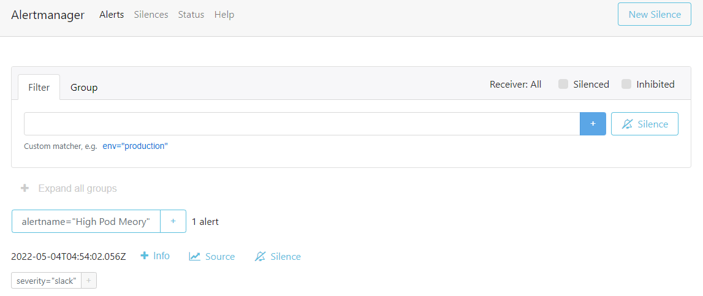

# Déploiement de Prometheus Alert Manager

### 1 - Déploiement de l'alerting

```
mkdir  -p ~vagrant/lab10 && cd ~vagrant/lab10
git clone https://github.com/eazytrainingfr/prometheus-training.git
cp  prometheus-training/sources/prometheus/alertmanager-* .
kubectl apply -f alertmanager-deployment.yaml
kubectl apply -f alertmanager-service.yaml
```
Le service écoute sur le nodeport **32000** du cluster


### configuration de l"alerting dans la conf promethus
```
cp prometheus-training/lab-10/* .
rm -rf prometheus-training
```
### Prise en compte des modifications
Vous devez supprimer et recréer le configmap ainsi que le deployment de Prometheus pour appliquer les modifications
```
kubectl delete configmaps prometheus-server-conf -n monitoring
kubectl create -f config-map.yaml
kubectl delete deployments.apps prometheus-deployment -n monitoring
kubectl apply -f prometheus-deployment.yaml -n monitoring
```

A présent, vérifier l'alerte dans prometheus, et son envoie à l'alert Manager
Dans prometheus, on a : 


Et au bout d'un certain temps, on observe dans L'alert Manager ceci : 


