# Configuration  du webhook dans slack
Dans slack, on va chercher l'application **Webhooks entrants** et la rajouter


Ceci s'ouvre dans le navigateur


On va configurer : 
- Configurer le channel d'envoie des notifications
  
- Récupérer l'url du webhook générée
  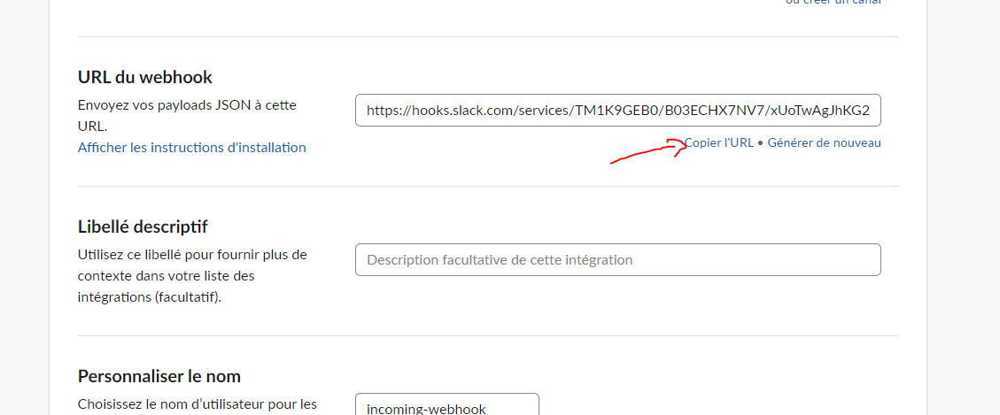

Une fois configuré, on va retourner intégrer celà dans Grafana
  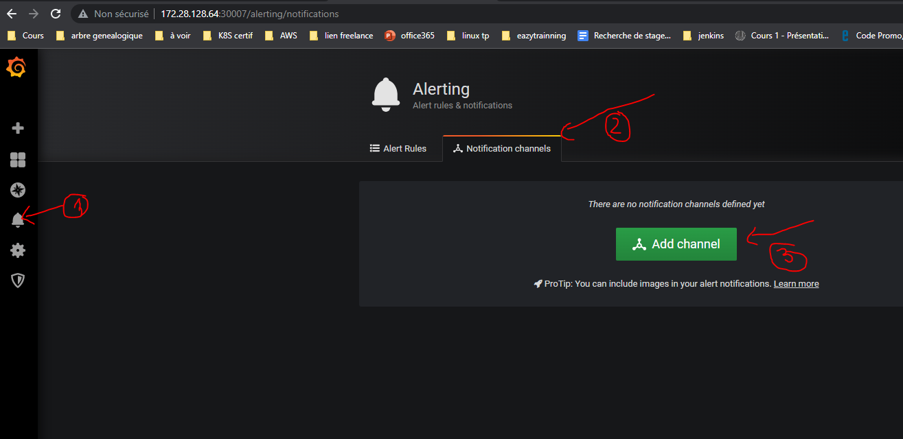
  ensuite : 
  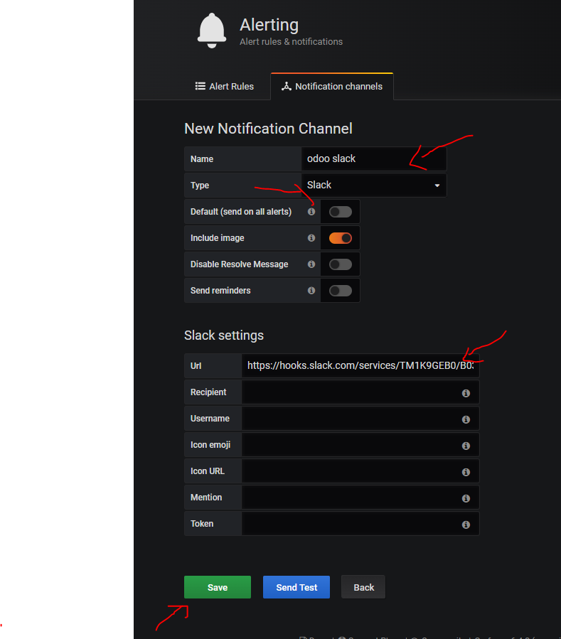
Du coup, on peut voir le test de notification dans le channel slack
  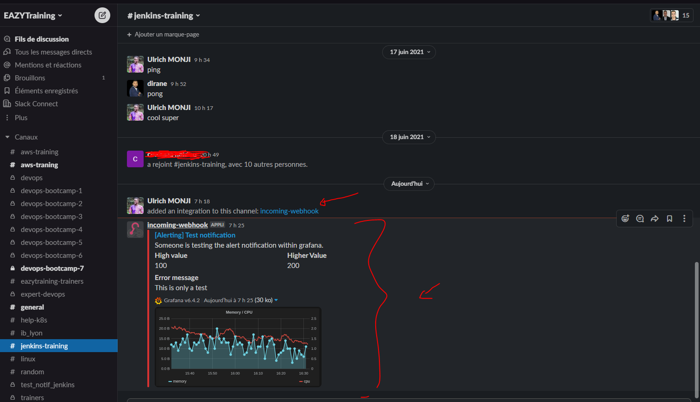

A présent, il faut créer la règle devant déclencer l'alerting.
Dans le dashboard blackbox exporter, On va rajouter un nouveau graphe : 
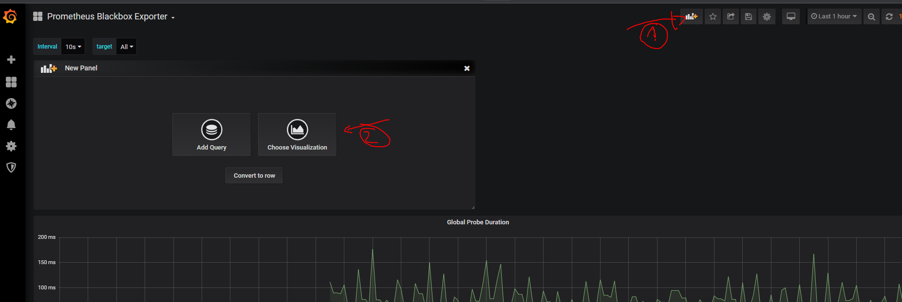
On configure le type de graphe et les axes
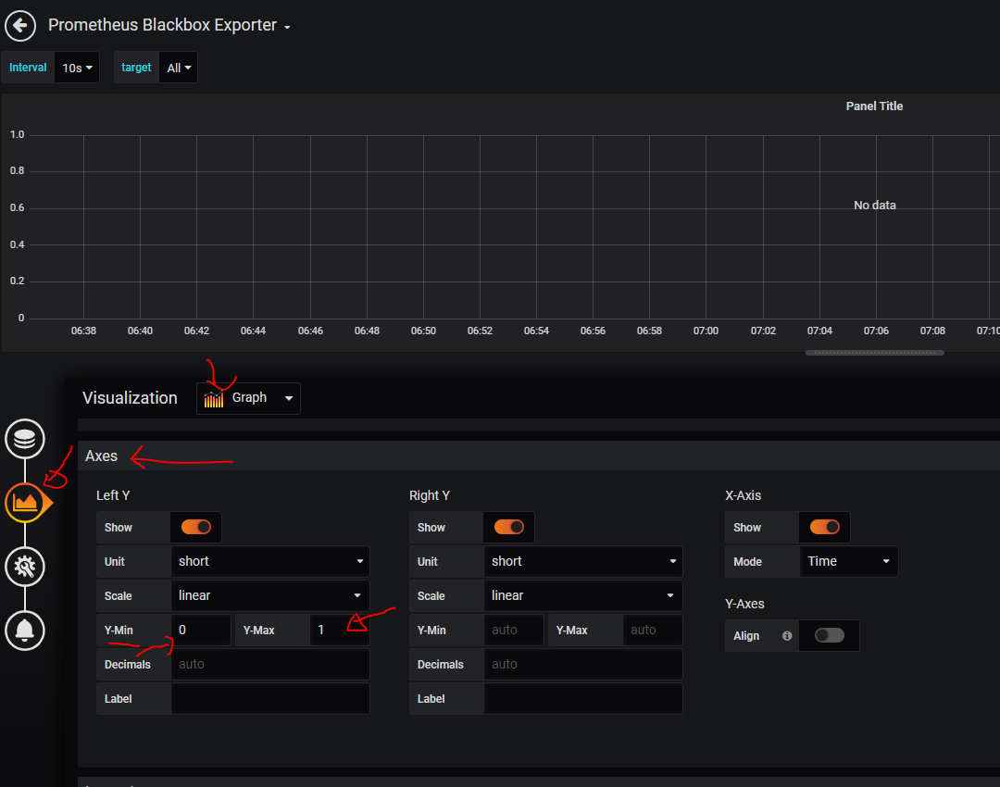
On configure l'alarming
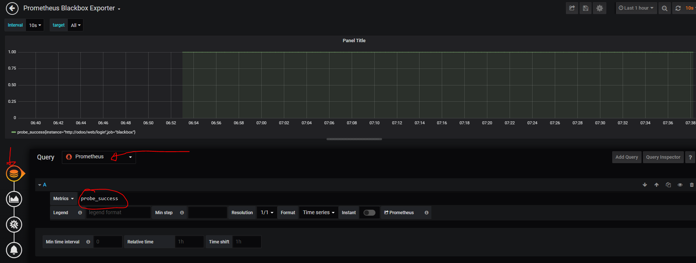
Dans l'alarming, on configure le message à envoyer et à quel channel
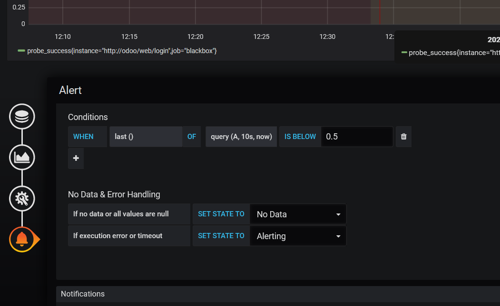
En suite on sauvegarde
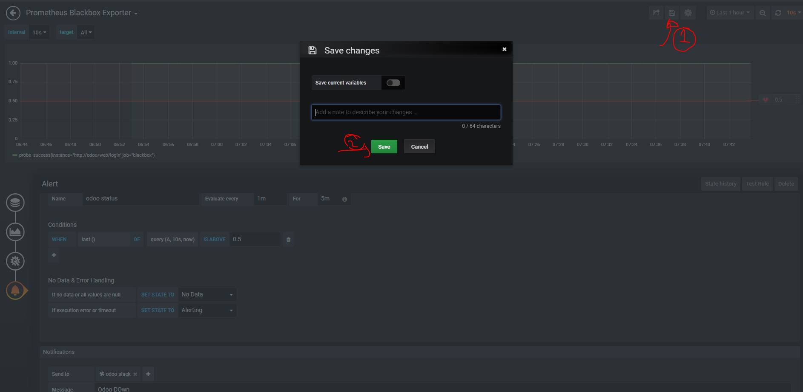
On a à présent le nouveau graphe dans le dashboard qui apparait
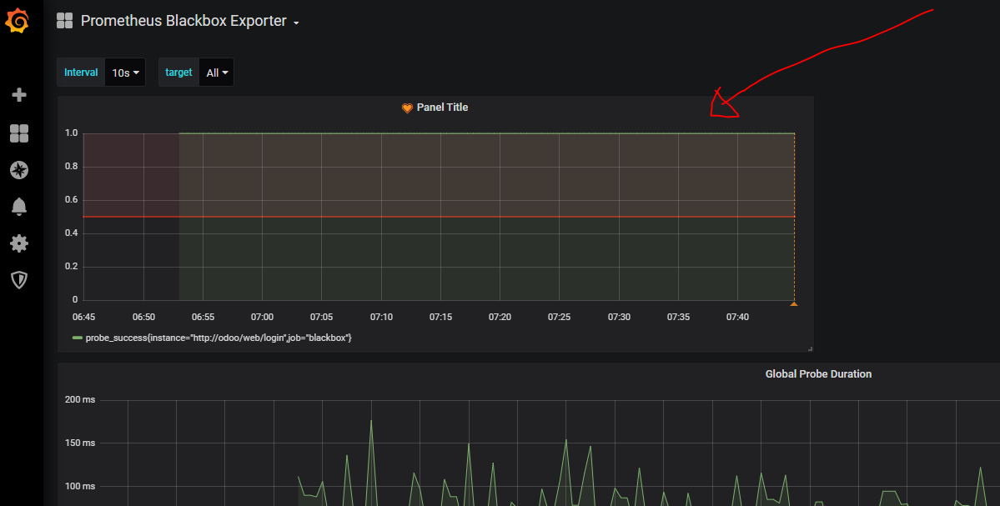

Il est à présent question de simuler une alarme
On va scaler le nombre de replicat de notre deploiement odoo à zéro : 
```
kubectl scale deployment odoo --replicas 0
kubectl get deploy
```
On a ceci : 
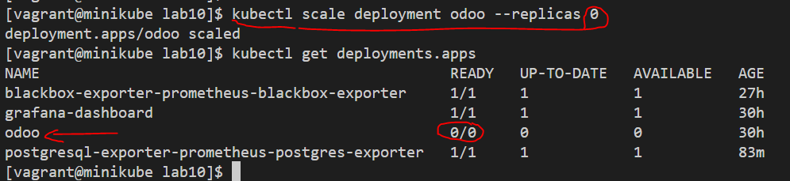

Le Dashboard détecte direcement que l'applicatione est Down
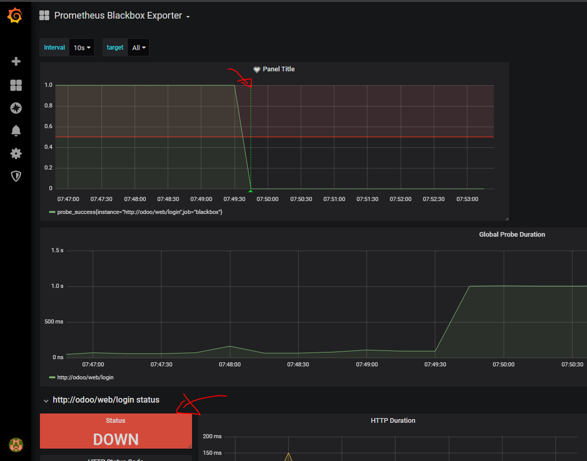

Dans le channel slack, on devrait avoir une notification
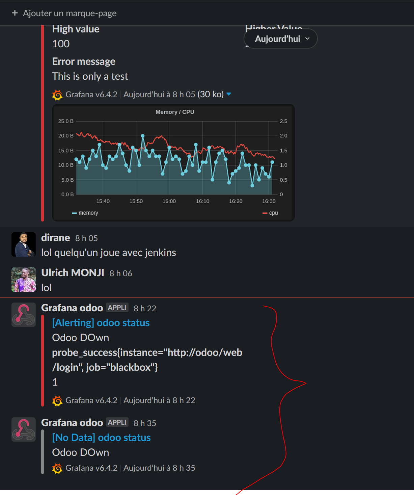