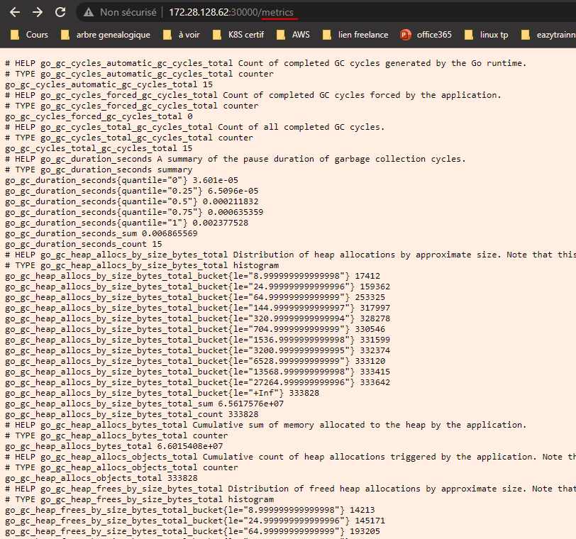

# Installation de PROMETHEUS
#### 1 - Créez un namespace monitoring
```
[vagrant@minikube lab1]$ kubectl create namespace  monitoring 
```

#### 2 - Déployez Prometheus à l’aide des [sources fournies](https://github.com/eazytrainingfr/prometheus-training/tree/main/sources/prometheus) :
On va déployer les manifestes suivants : 
- clusterRole.yaml
- config-map.yaml
- prometheus-deployment.yaml
- prometheus-service.yaml

On a donc ceci : 
```
[vagrant@minikube lab1]$ mkdir -p ~vagrant/lab2 && cd ~vagrant/lab2
[vagrant@minikube lab2]$ git clone https://github.com/eazytrainingfr/prometheus-training.git
[vagrant@minikube lab2]$ cp prometheus-training/sources/prometheus/* . 
[vagrant@minikube lab2]$ rm -rf prometheus-training
[vagrant@minikube lab2]$ kubectl apply -f config-map.yaml
[vagrant@minikube lab2]$ kubectl apply -f clusterRole.yaml
[vagrant@minikube lab2]$ kubectl apply -f prometheus-deployment.yaml
[vagrant@minikube lab2]$ kubectl apply -f prometheus-service.yaml
```

#### 3 - Etudiez les fichiers et déduisez comment accéder à l’application via le nodeport
On va acceder a l'application sur le nodeport **30000**


#### 4 - Découvrez l’interface

Validez que l'interface est très jolie avant de continuer. (mdrr)

#### 5 - Allez dans les targets et verifiez que le target Prometheus est bien présente et up
- Dans Status -> target, on peut voir les endpoints où il récupère les données. Dans notre cas, on voit que prometheus se monitore lui même


- Si on va à cette url : http://172.28.128.62:30000/**metrics**, on peut visualiser l'ensemble des métriques. Ces métriques sont difficilement exploitables par un décideur



##Félicitations ! Vous pouvez passer au lab-3
