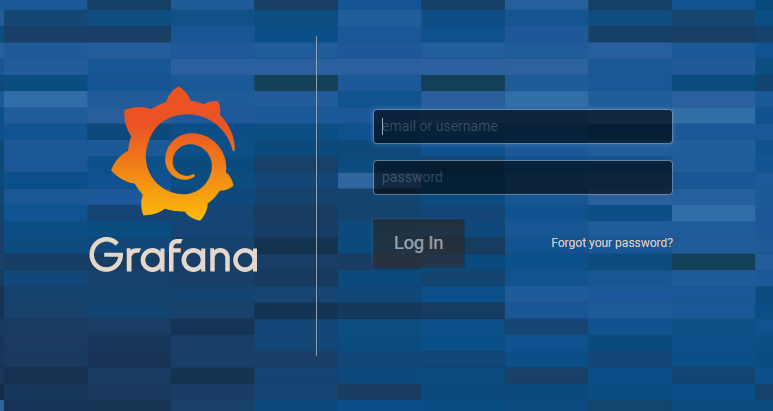

## Déploiement de GRAFANA
### 1 - Déployez Grafana à l’aide du chart Grafana 
Le faire en version 3.12.1 disponible sur le helm [Communautaire](https://github.com/grafana/helm-charts/tree/main/charts/grafana) Surchargez les variables du chart en utilisant le fichier values.yaml fournies dans les [sources](https://github.com/eazytrainingfr/prometheus-training/blob/main/sources/grafana/values.yaml)
On a donc ceci : 
```
[vagrant@minikube lab2]$ mkdir  -p ~vagrant/lab3 && cd ~vagrant/lab3
[vagrant@minikube lab3]$ helm repo add grafana https://grafana.github.io/helm-charts
[vagrant@minikube lab3]$ helm repo update
[vagrant@minikube lab3]$ git clone https://github.com/eazytrainingfr/prometheus-training.git
[vagrant@minikube lab3]$ cp prometheus-training/sources/grafana/* .
[vagrant@minikube lab3]$ rm -rf prometheus-training
[vagrant@minikube lab3]$ helm install grafana-dashboard -f values.yaml  grafana/grafana --version 3.12.1
```

### 2 - A l’aide du fichier deduisez comment accéder au dashboard 
Il faudra recupérer le mot de passe comme précisé après le déploiement du chart
Vous devriez avoir ceci : 


!!! - Ne pas oublier de lire l'output pour voir les infos de connexion etc ...
D'après l'output, il faudrait taper les commandes suivantes : 
```
[vagrant@minikube lab3]$ kubectl get secret --namespace default grafana-dashboard -o jsonpath="{.data.admin-password}" | base64 --decode ; echo
[vagrant@minikube lab3]$ export NODE_PORT=$(kubectl get --namespace default -o jsonpath="{.spec.ports[0].nodePort}" services grafana-dashboard)
[vagrant@minikube lab3]$ export NODE_IP=$(kubectl get nodes --namespace default -o jsonpath="{.items[0].status.addresses[0].address}")
[vagrant@minikube lab3]$ echo http://$NODE_IP:$NODE_PORT
```   
Dnas mon cas, le user est **admin**, le mot de passe initial est **4rGGmPZgwqKIDsrW9ShUXhCIYile8DMq1cKl9Pfh** et l'url de connexion est **http://10.0.2.15:30007**

L'interface de Grafana est la suivante : 

Et une fois loggé, on a ceci : 


### 3 - Configurez la datasource pour qu’elle pointe sur la target de Prometheus

L'url du datasource est :  http://prometheus-service.monitoring.svc:8090

On a ceci : 


### 4 - Importez le dashboard Prometheus d’id 3662

L'url de ce dashboard est [celle ci](https://grafana.com/grafana/dashboards/3662)
VOus pouvez vous amuser à parcourir le site de Grafana pour voir d'autres dashboard disponibles)

### 5 - Que constatez-vous ?
On constate des courbes dans Grafana, les données sont plus exploitables

### 6 - Si vous avez des métriques qui s’affichent, alors felicitation, votre installation de Prometheus et Grafana est terminée !
