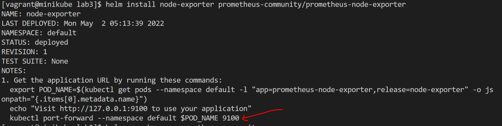
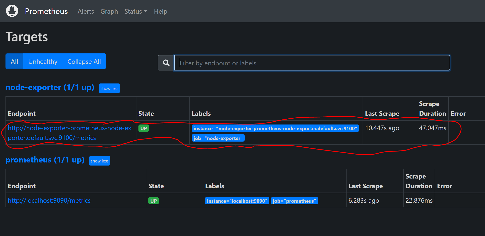
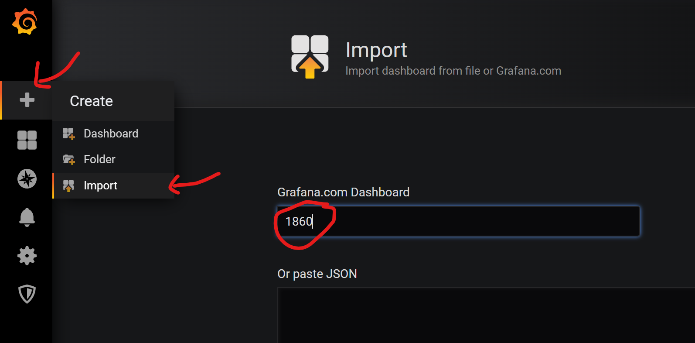

### installation du node-exporter à l'aide de helm
Les chart sont ici :  https://prometheus-community.github.io/helm-charts/*

Installons le chart : 
```
helm repo add prometheus-community https://prometheus-community.github.io/helm-charts
helm repo update
```

Installation du node-exporter
```
helm search repo prometheus-community
helm install node-exporter prometheus-community/prometheus-node-exporter
```

On a ceci : 


### connexion entre prometheus et le node-exporter
!!! - le fichier configmap est donné avec l'enonce. Il contient une nouvelle target pour scrapper les métriques 
```
mkdir  -p ~vagrant/lab4 && cd ~vagrant/lab4
git clone https://github.com/eazytrainingfr/prometheus-training.git
cp prometheus-training/sources/prometheus/config-map.yaml  .
cp prometheus-training/sources/prometheus/prometheus-deployment.yaml  .
vi config-map.yaml
```

Ensuite on va supprimer le configmap et le re-créer dans le cluster k8s
```
kubectl delete configmaps prometheus-server-conf -n monitoring
kubectl create -f config-map.yaml
kubectl delete deployments.apps prometheus-deployment -n monitoring
kubectl apply -f prometheus-deployment.yaml -n monitoring
rm -rf prometheus-training
```

A présent, dans prometheus, on devrait voir apparaître une nouvelle target : 


### Dashboard node-exporter
Sur les dashboard communotaires de Grafana, on va chercher le dashboard **1860** :
Son url :  https://grafana.com/grafana/dashboards/1860
ensuite on va l'importer dans Grafana comme suit : 

