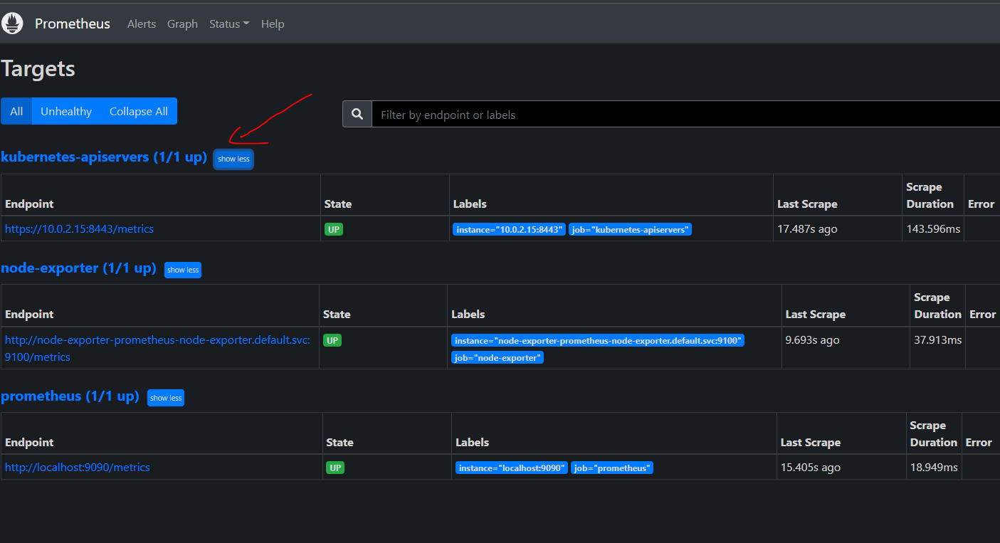

# Monitoring du cluster K8S
### 1 - Endpoint de l’API Kubernete
Modifiez le configmap prometheus afin d’y intégrer le endpoint de l’API Kubernetes (n’hésitez pas à regarder la Doc)

```
mkdir  -p ~vagrant/lab5 && cd ~vagrant/lab5
git clone https://github.com/eazytrainingfr/prometheus-training.git
cp prometheus-training/lab-5/* .
rm -rf prometheus-training
```


### 2 - Prise en compte des actions
Vous devez supprimer et recréer le configmap ainsi que le deployment de Prometheus pour appliquer les modifications
```
kubectl delete configmaps prometheus-server-conf -n monitoring
kubectl create -f config-map.yaml
kubectl delete deployments.apps prometheus-deployment -n monitoring
kubectl apply -f prometheus-deployment.yaml -n monitoring
```
### 3 - Vérification de la nouvelle target
Vérifiez sur l’interface de Prometheus que la target apiserver est bien présente et up


### 4 - Import du dashbord 12006
Pour terminer, importer le dashboard **12006** permettant de visualiser les métriques des API k8s


### 5 - Check des métriques apiservers
Vérifiez que le dashboard nouvellement importé affiche des données
