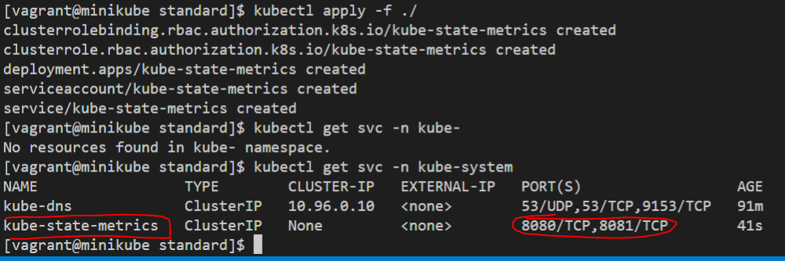
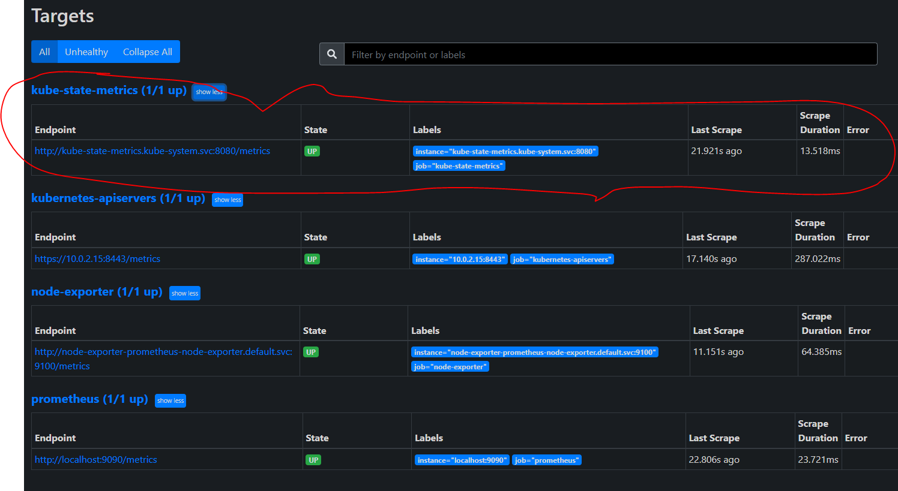
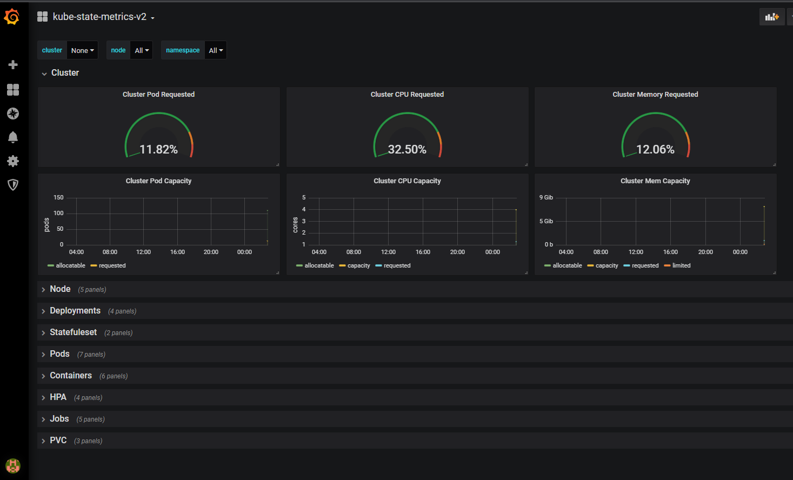

### 1 - Déploiement du State-metrics
Déployez kube-state-metrics à l’aide de la documentation officielle en déployement l’ensemble des manifests présent.
La documentation est disponible [ici](https://github.com/kubernetes/kube-state-metrics/tree/master/docs)

On va télécharger le repos
```
mkdir  -p ~vagrant/lab6 && cd ~vagrant/lab6
git clone https://github.com/kubernetes/kube-state-metrics.git
cd kube-state-metrics/examples/standard/
kubectl apply -f ./
kubectl get svc -n kube-system
cd ~vagrant/lab6
rm -rf kube-state-metrics
```
On peut visualiser le service créé pour ce nouveau déploiement


### 2 - Configuration du configmap
Modifiez le configmap prometheus afin d’y intégrer le endpoint de kube-state-metrics précédement déployé (n’hésitez pas à regarder la Doc)
```
git clone https://github.com/eazytrainingfr/prometheus-training.git
cp prometheus-training/lab-6/* .
rm -rf prometheus-training
```


### 3 - Prise en compte des modifications
Vous devez supprimer et recréer le configmap ainsi que le deployment de Prometheus pour appliquer les modifications
```
kubectl delete configmaps prometheus-server-conf -n monitoring
kubectl create -f config-map.yaml
kubectl delete deployments.apps prometheus-deployment -n monitoring
kubectl apply -f prometheus-deployment.yaml -n monitoring
```
### 4 - Endpoint kube state metrics
Vérifiez sur l’interface de Prometheus que la target kube state est bien présente et up



### 5 - Check de la métrique kube_deployment_status_replicas
Toujours sur l’interface de Prometheus vous pouvez vous assurez que la métrique **kube_deployment_status_replicas** renvoie un resultat


### 6 - Import du Dashboard 13332
Pour terminer, importer le dashboard **13332** permettant de visualiser les métriques de kube-state
Son url est [ici](https://grafana.com/grafana/dashboards/13332)

### 7 - Check du Dashboard
Vérifiez que le dashboard nouvellement importé affiche des données
