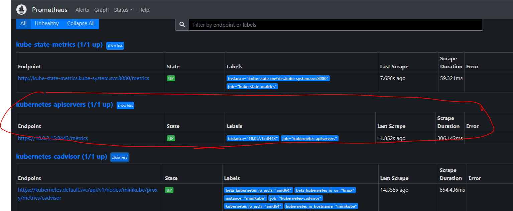
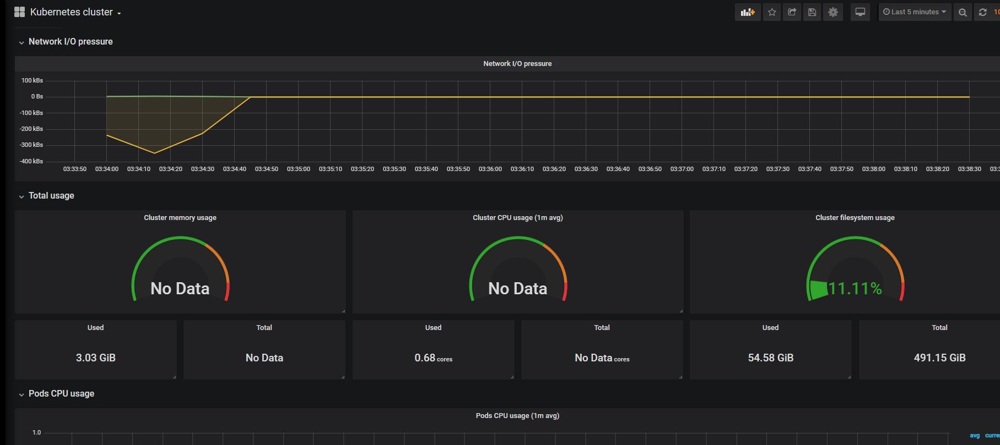
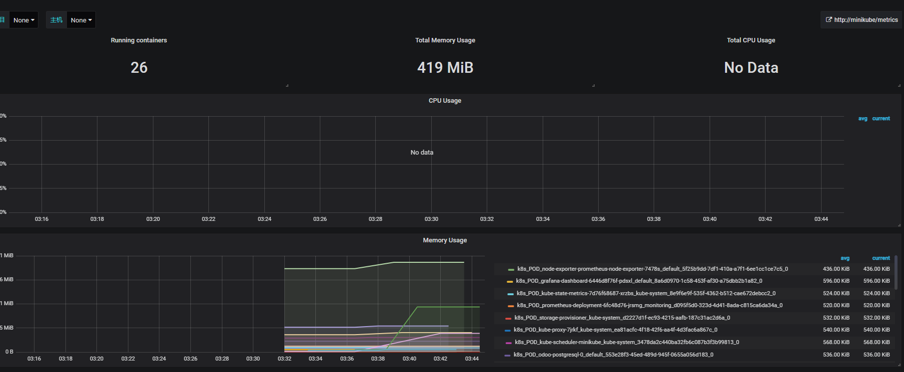

# Cadvisor
Le but de ce lab est de visualiser les métriques de type container

### 1 - Configuration du configmap
Modifiez le configmap prometheus afin d’y intégrer le endpoint de Kubernetes-cadvisor (n’hésitez pas à regarder la Doc)
```
mkdir  -p ~vagrant/lab7 && cd ~vagrant/lab7
git clone https://github.com/eazytrainingfr/prometheus-training.git
cp prometheus-training/lab-7/* .
rm -rf prometheus-training
```
### 2 - Prise en compte des modifications
Vous devez supprimer et recréer le configmap ainsi que le deployment de Prometheus pour appliquer les modifications
```
kubectl delete configmaps prometheus-server-conf -n monitoring
kubectl create -f config-map.yaml
kubectl delete deployments.apps prometheus-deployment -n monitoring
kubectl apply -f prometheus-deployment.yaml -n monitoring
```
### 3 - Endpoint Cadvisor
Vérifiez sur l’interface de Prometheus que la target Kubernetes-cadvisor est bien présente et up

### 4 - Import des dashboards 12206 et 11277
Pour terminer, importer les dashboards no **12206** et **11277** permettant de visualizer les métriques cadvisor

### 5  - Check des dashboards
Vérifiez que le dashboard nouvellement importé affiche des données
##### Dashboard Cadvisor

##### Dashboard Docker
