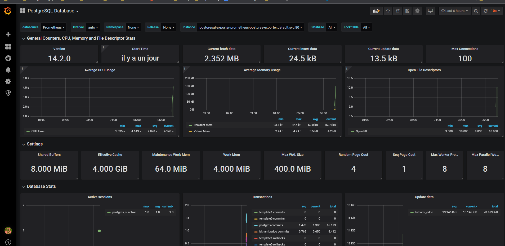

# Déploiement de Postgres exporter

### 1 - Installation de l'exporter et surcharge du values.yaml
Installez le postgres exporter Prometheus à l’aide du chart helm disponible sur le [repo prometheus-postgres-exporter](https://github.com/helm/charts/tree/master/stable/prometheus-postgres-exporter)

```
mkdir  -p ~vagrant/lab9 && cd ~vagrant/lab9
git clone https://github.com/eazytrainingfr/prometheus-training.git
cp  prometheus-training/sources/postgres-exporter/*  .
helm install postgresql-exporter prometheus-community/prometheus-postgres-exporter -f values.yaml
```
Ne pas oublier de lire la sortie de la commande helm qui demande de taper ces commandes : 
```
export NODE_PORT=$(kubectl get --namespace default -o jsonpath="{.spec.ports[0].nodePort}" services postgresql-exporter-prometheus-postgres-exporter)
  export NODE_IP=$(kubectl get nodes --namespace default -o jsonpath="{.items[0].status.addresses[0].address}")
  echo http://$NODE_IP:$NODE_PORT
```  

Il est donc diponible sur le nodeport **30786**

### 2 - Surchargez les variables du chart avec le fichier values.yaml
C'est déja fait à la question précédente ...

### 3 - Prise en compte des modifications
Modifier la fichier **config-map.yaml** afin d’intégrer le postgres-exporter (un job si vous voulez)
```
cp prometheus-training/lab-9/* .
rm -rf prometheus-training
```

### 4 - Prise en compte des modifications
Vous devez supprimer et recréer le configmap ainsi que le deployment de Prometheus pour appliquer les modifications
```
kubectl delete configmaps prometheus-server-conf -n monitoring
kubectl create -f config-map.yaml
kubectl delete deployments.apps prometheus-deployment -n monitoring
kubectl apply -f prometheus-deployment.yaml -n monitoring
```

### 5 - Check du endpoint
!!! - Si le endoint n'arrive pas à se connecer à l'exporter, alors vérifier le password dans le fichier values.yaml. Un fichier values.yaml correctif vous est donné avec l'énoncé

Vérifiez sur l’interface de Prometheus que la target blackbox-exporter est bien présente et up


### 6 -  Pour terminer, importer le dashboard postgre **9628**
Rien de nouveau à la procédure habituelle

### 7 - Vérifiez que le dashboard nouvellement importé affiche des données
